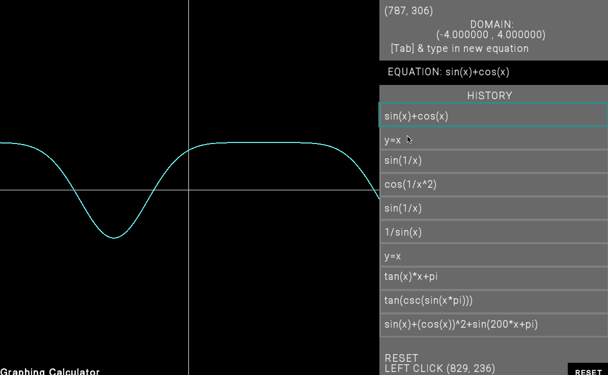

# Work Report

## Name: <ins> Yi Zhuang </ins>

## Features:
- Implemented:
  - User input equations (trig, polynomial, log) from the interface.
  - Zoom in and out (keyboard or mousewheel)
  - Pan up, down, left, right (keyboard arrows)
  - History is displayed on the sidebar
  - Clickable items in history & equations will be graphed once clicked 
  - Save history upon exiting the program or when "save" command is issued
  - Load history upon entry to the program
  - "reset" command will take user to default domain, equation, and places origin at center of work area.
  

- Not Implemented:
  - Polar coords
  - Rotating graphs
  - Responsive gridlines 
  - Mouse interface: drag
  - Right click 
  - Additional functions
  - Light & Dark mode

  

# Reflections:

- 

# **output**

<pre>
  
Output Gif
  
</pre>

  

# basic_test.cpp output:
<pre>
    
</pre>
# testB.cpp output:
<pre>
    
</pre>

